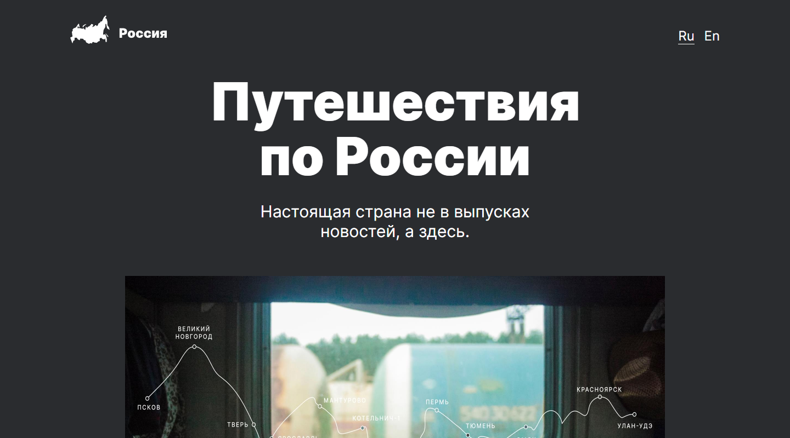

# Проект: Путешествие по России

Учебный проект выполненный в рамках курса "Веб-разработчик" от Яндекс Практикум. Проект представляет из себя лендинг рассказывающий о путешествиях по России, и интересных местах для отдыха.

## Оглавление

- [Обзор проекта](#обзор-проекта)
  - [Задачи проекта](#задачи-проекта)
  - [Функциональность проекта](#функциональность-проекта)
  - [Screenshot](#screenshot)
  - [Директории проекта](#директории-проекта)
  - [Запуск проекта](#запуск-проекта)
  - [Ссылки](#ссылки)
- [Ход выполнения проекта](#ход-выполнения-проекта)
  - [Используемые технологии](#используемые-технологии)
  - [Чему я научился работая над проектом](#чему-я-научился-работая-над-проектом)
- [Автор](#автор)

## Обзор проекта

### Задачи проекта

Проект был призван изучить основы HTML, CSS, семантической вёрстки, БЭМ, и адаптивной вёрстки.

### Функциональность проекта

Проект выполнен в виде лендинга состоящего из нескольких секций. В проекте реализованы различные подходы к позиционированию и выравниванию элементов, в том числе Flexbox и Grid Layout. Проект адаптирован для просмотра на мобильных устройствах.

### Screenshot

### Директории проекта

- `/blocks` — директория с CSS файлами
- `/fonts` — директория со шрифтами
- `/images` — директория с файлами изображений
- `/pages` — директория с файлами страниц
- `src/vendor` — директория с файлами библиотек

### Запуск проекта

Поскольку в проекте не используются сборщики или планировщики, то проект нужно просто клонировать и открыть index.html в браузере или с помощью LiveServer.

### Ссылки

- [Ссылка на репозиторий проекта](https://github.com/Bjorn86/russian-travel)
- [Ссылка на демо-страницу проекта](https://bjorn86.github.io/russian-travel/)

## Ход выполнения проекта

### Используемые технологии

- HTML
- CSS
- Семантическая вёрстка
- Адаптивная вёрстка
- БЭМ, включая использование схемы файловой структуры Nested

### Чему я научился работая над проектом

- Позиционированию и выравниванию элементов страницы при помощи различных подходов
- Семантической вёрстке
- Адаптивной вёрстке
- Методологии БЭМ

## Автор

**Данила Легкобытов**

- e-mail: [legkobytov-danila@yandex.ru](mailto:legkobytov-danila@yandex.ru)
- Telegram: [@danila_legkobytov](https://t.me/danila_legkobytov)
